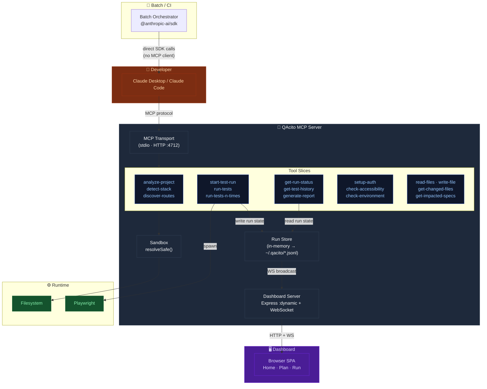
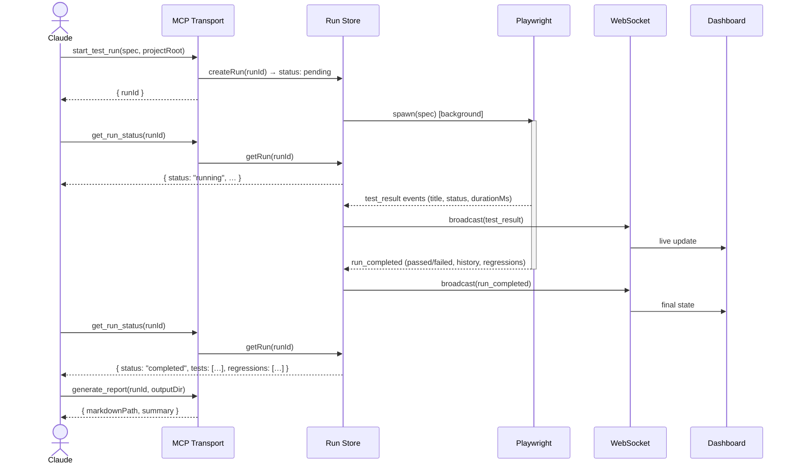

# QAcito — Architecture

> **Core principle:** Claude decides, QAcito executes. The server never interprets results or chooses what to test.

## System overview

## Async run flow

The most non-obvious behavior: `start_test_run` returns immediately with a `runId`. Playwright runs in the background. Claude polls with `get_run_status` while the Dashboard receives live updates via WebSocket push.

## Key constraints

- `console.log` → stderr at startup. Any stdout write corrupts the stdio JSON-RPC wire.
- All paths go through `resolveSafe(root, p)` before touching the filesystem or spawning processes.
- Run store mutations are synchronous (no `await` inside read-modify-write cycles) — Node.js single-thread guarantee.
- `runId` is valid only for the lifetime of the server process.
